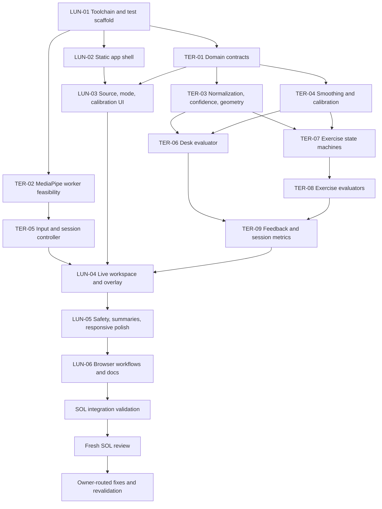

# Implementation Plan: Privacy-First AI Body Posture Coach MVP

## 1. Authority and scope

Owner: `sol_orchestrator`.

This plan authorizes implementation of the browser-local MVP described in the master build prompt. It does not authorize commits, pushes, deployments, purchases, analytics, accounts, backend APIs, frame uploads, or frame retention.

Implementation state: integrated local MVP is present. The repository includes the Next.js static app, worker-backed MediaPipe pipeline, pure domain engine, fixtures, tests, pinned assets, and validation artifacts. No Git repository, commit, push, or deployment was created.

## 2. Product outcome

A polished Next.js/TypeScript application that performs MediaPipe Pose Landmarker inference in the browser for webcam and user-selected video, renders a skeleton overlay, calibrates to the current user and camera view, and emits deterministic educational feedback for desk posture plus squat, plank, push-up, lunge, and bicep curl.

The product is not a medical device. It must abstain when evidence is unreliable and must never diagnose, claim clinical accuracy, or promise injury prevention.

## 3. Source constraints and architecture decisions

Primary technical sources:

- Google AI Edge Pose Landmarker overview: <https://developers.google.com/edge/mediapipe/solutions/vision/pose_landmarker>
- Google AI Edge Web guide: <https://developers.google.com/edge/mediapipe/solutions/vision/pose_landmarker/web_js>
- Official MediaPipe repository: <https://github.com/google-ai-edge/mediapipe>
- Official samples: <https://github.com/google-ai-edge/mediapipe-samples>

Verified on 2026-08-04 against the official Web guide:

- Web uses `@mediapipe/tasks-vision`, `FilesetResolver`, and a compatible `.task` model.
- Web Pose Landmarker exposes `IMAGE` and `VIDEO` running modes. Webcam and uploaded decoded frames therefore use `VIDEO` plus `detectForVideo`.
- `detect()` and `detectForVideo()` are synchronous and block their calling thread. Inference must run in a dedicated worker unless the feasibility spike proves an explicit, measured compatibility exception.
- Configuration includes `numPoses`, detection/presence/tracking confidence thresholds, and optional segmentation masks.
- Results contain 33 normalized image landmarks and 33 world landmarks. Normalized coordinates drive overlay projection; evaluators select normalized or world-space geometry explicitly per metric.
- Pose Landmarker Full is the default model. Segmentation masks remain off in MVP because they add cost without satisfying a requirement.

Architecture decisions:

1. **Static, client-only product.** Next.js App Router with TypeScript and Tailwind. No API routes, database, account, telemetry, paid AI, or Python service. Prefer static export. Any need to add a server requires a written Sol decision and user approval.
2. **Client boundary.** Camera, uploaded-video, worker, and MediaPipe imports are initialized only after client mount and explicit user action. Server rendering must not touch `window`, media devices, workers, or MediaPipe.
3. **Self-hosted inference assets.** Pin `@mediapipe/tasks-vision`; serve its compatible Wasm files and the official Pose Landmarker Full model from same-origin `public/wasm` and `public/models`. Do not use `@latest` or runtime third-party CDN fetches.
4. **Worker-owned MediaPipe lifecycle.** One dedicated worker creates and closes the landmarker. Main thread sends transferable frame data and a monotonic timestamp. Maximum one frame in flight; newer frames replace/drop pending work rather than queueing unbounded inference.
5. **Session lifecycle boundary.** The current integrated slice keeps source switching, frame scheduling, worker messages, cancellation, object-URL cleanup, and media-track cleanup in the client `CoachApp` adapter; the worker client and pure domain engine remain framework-independent. A separate controller extraction is a follow-up refactor, not a hidden claim of current architecture.
6. **Canonical coordinates.** Domain landmarks remain anatomically labeled and unmirrored. Selfie mirroring is presentation-only. Uploaded video defaults unmirrored and exposes an explicit mirror correction. Evaluation pauses when orientation/mirroring is unresolved.
7. **Evidence pipeline.** Raw result -> normalization -> per-landmark presence/visibility gate -> temporal smoothing -> calibration/view gate -> geometry -> mode state machine/evaluator -> persistence/hysteresis -> priority resolver -> aggregate session metrics.
8. **Deterministic engine.** `src/domain/**` has no React, DOM, browser globals, MediaPipe classes, network access, randomness, or wall-clock reads. Time is passed in. All thresholds, hold durations, state transitions, and message IDs are typed and testable.
9. **View-specific abstention.** Each metric declares required landmarks and camera view. A single view is not assumed to support every desk metric. Unsupported or occluded metrics report positioning guidance or `insufficient_evidence`, never authoritative form advice.
10. **Calibration before coaching.** Calibration validates full-body/framing/view stability over a bounded window and derives user-relative baselines. Reset on source, mode, mirror, or material camera-orientation change. Defaults may only power positioning guidance, not personalized authoritative corrections.
11. **Temporal policy.** No one-frame warnings or rep counts. Smoothing, minimum persistence, hysteresis, phase dwell, and cooldown are explicit. Invalid repetitions carry deterministic reason codes when evidence supports one.
12. **Feedback policy.** At most one corrective cue at a time. Priority is deterministic: safety/insufficient evidence -> positioning -> invalid-rep reason -> highest-severity persistent form cue -> positive/neutral guidance.
13. **Ephemeral data.** Frames and landmarks stay in memory and are disposed after processing. Uploaded files use a local object URL that is revoked. Session summaries store aggregate counters/durations only in memory and reset on refresh unless the user later authorizes persistence.
14. **Accessible presentation.** Canvas is supplementary. Equivalent text/status is available to assistive technology; keyboard focus, reduced motion, contrast, responsive layout, and non-color-only states are required.

## 4. Proposed module boundaries

```text
app/                         Luna: route shell and global styling
components/                  Luna: React presentation and UI adapter hook
src/vision/                  Terra: browser input, worker protocol/client, scheduling
src/domain/                  Terra: pure contracts, geometry, calibration, engines
public/models/               Terra: pinned official Full model
public/wasm/                 Terra: pinned package-compatible Wasm assets
tests/ui/                    Luna: component/accessibility tests
tests/e2e/                   Luna: critical browser workflows and fixtures
tests/domain/                Terra: deterministic fixtures and engine tests
docs/                        Luna by assigned file; Sol for architecture/integration ADRs
tasks/                       Sol only
```

The agent TOMLs are upper bounds. Each dispatch must further restrict its package to the exact files/directories listed below. Luna must not edit `public/models/**`, `public/wasm/**`, `src/domain/**`, `src/vision/**`, or `tests/domain/**`. Terra must not edit `app/**`, `components/**`, `styles/**`, `tests/ui/**`, `tests/e2e/**`, or root configuration. Shared-contract changes are Terra-owned and reviewed by Sol before dependent UI work continues.

## 5. Dependency graph



Parallel lanes are allowed only where the graph has no dependency edge. Specifically, LUN-02 may run beside TER-01/TER-02 after LUN-01. TER-03 and TER-04 may run in parallel after TER-01 if they do not edit the same files. Evaluator packages run only after their shared contracts are frozen.

## 6. Bounded implementation work packages

### LUN-01 — Toolchain and quality scaffold

Owner: `luna_implementer`  
Exclusive scope: `package.json`, lockfile, `tsconfig.json`, `next.config.*`, `postcss.config.*`, `eslint.config.*`, `vitest.config.*`, `playwright.config.*`.

Deliver Next.js/React/TypeScript/Tailwind/Vitest/Playwright scripts with exact dependency versions and static-export intent. Add scripts for format check, lint, typecheck, unit/domain tests, build, and browser tests. Do not add analytics, backend, auth, or a CDN dependency.

Acceptance:

- Clean install succeeds using the selected package manager and pinned lockfile.
- Empty scaffold scripts resolve and production build configuration is static-compatible.
- Dependency/license inventory names all runtime dependencies; MediaPipe package/model license remains a hard gate before asset acceptance.

Verification: record version commands, install, lint, typecheck, empty test invocation, and build result.

### TER-01 — Pure domain contracts and fixtures

Owner: `terra_implementer`  
Exclusive scope: `src/domain/contracts/**`, `src/domain/index.ts`, `tests/domain/fixtures/**`, `tests/domain/contracts.test.ts`.

Define serializable types for landmarks, frame observations, orientation, confidence/abstention states, calibration, movement phases, issue/rejection codes, evaluation results, prioritized feedback, and summaries. Include deterministic correct/incorrect/boundary/missing/low-confidence/mirrored/noisy/transition/invalid-rep fixtures.

Acceptance:

- No React, DOM, MediaPipe, or browser imports.
- Every evaluator output distinguishes `valid`, `insufficient_evidence`, and `unsupported_view`.
- Fixtures are named, immutable, and cover all required test classes from the prompt.

Verification: typecheck and contract/fixture tests.

### TER-02 — MediaPipe worker feasibility and pinned assets

Owner: `terra_implementer`  
Exclusive scope: `src/vision/worker/**`, `src/vision/mediapipe/**`, `public/models/**`, `public/wasm/**`, `tests/domain/vision-worker.test.ts`.

Prove that the installed `@mediapipe/tasks-vision` version initializes Pose Landmarker Full from same-origin assets in a dedicated worker and accepts transferable browser frame input. Implement typed request/result/error/dispose messages, monotonic timestamps, one-in-flight backpressure, and cleanup. Record package version, model URL/version, SHA-256, and license evidence in the handoff.

Acceptance:

- No `@latest`, CDN runtime fetch, frame upload, frame logging, or silent main-thread inference fallback.
- Uses Web `VIDEO` mode for camera/upload and returns normalized plus world landmarks and confidence fields.
- Worker failure becomes a typed recoverable compatibility/error state; all transferred frames/resources are closed or released.

Verification: worker unit tests plus a real-browser one-frame and repeated-frame smoke with console/network evidence. If worker compatibility fails, stop and return evidence to Sol before changing architecture.

### LUN-02 — Static app shell and design system

Owner: `luna_implementer`  
Exclusive scope: `app/**`, `styles/**`, `components/shell/**`.

Build the responsive product shell, navigation/mode framing, typography, tokens, loading/error boundaries, metadata, and non-medical product positioning. No camera logic or evaluation logic.

Acceptance:

- Useful static shell at 320/768/1024/1440 without overflow.
- Keyboard-visible focus, semantic landmarks, contrast-aware tokens, reduced-motion support.
- Visible concise privacy statement and educational/non-medical disclaimer.

Verification: component render/accessibility checks and responsive screenshots.

### TER-03 — Normalization, confidence, and geometry

Owner: `terra_implementer`  
Exclusive scope: `src/domain/landmarks/**`, `src/domain/confidence/**`, `src/domain/geometry/**`, matching `tests/domain/*` files.

Normalize raw worker output into domain contracts; preserve left/right anatomy; model visual mirror separately; implement required-landmark confidence gates and guarded 2D/3D geometry. Invalid/degenerate calculations return explicit unavailable results rather than NaN or advice.

Acceptance:

- Confidence combines required presence/visibility and mode-specific landmark sets.
- Mirror tests prove presentation transforms do not swap anatomical meaning.
- Boundary, missing, low-confidence, and degenerate geometry fixtures abstain deterministically.

Verification: focused domain tests, typecheck, randomized finite-number/property checks where practical.

### TER-04 — Temporal smoothing and calibration

Owner: `terra_implementer`  
Exclusive scope: `src/domain/temporal/**`, `src/domain/calibration/**`, matching `tests/domain/*` files.

Implement timestamp-aware smoothing, bounded history, persistence/hysteresis primitives, stable-window calibration, reset rules, and view/orientation validation. Time must be injectable.

Acceptance:

- Out-of-order/duplicate timestamps, long gaps, and dropped frames are handled explicitly.
- Calibration cannot complete with unstable, missing, low-confidence, or unsupported-view evidence.
- Reset occurs on source/mode/mirror/material orientation change; noisy-sequence and calibration-reset fixtures pass.

Verification: fake-clock deterministic tests and memory-bound assertions.

### TER-05 — Camera, upload, and session controller

Owner: `terra_implementer`  
Exclusive scope: `src/vision/input/**`, `src/vision/session/**`, `src/vision/index.ts`, matching `tests/domain/vision-session.test.ts`.

Implement explicit-start `getUserMedia`, permission/error mapping, browser-decodable local upload, source switching, frame scheduling, worker backpressure, object URL lifecycle, and cleanup. Prefer `requestVideoFrameCallback` with a tested bounded fallback.

Acceptance:

- Camera starts only from user action; every track stops on stop/switch/unmount/page hide.
- Uploaded bytes never leave the browser; unsupported/undecodable files produce a clear typed error; object URLs are revoked.
- Scheduler processes no duplicate video time, maintains monotonic timestamps, has at most one inference in flight, and cancels stale-session results.

Verification: unit tests with mocked media APIs plus real browser camera-permission/no-camera/upload flows later in SOL validation.

### LUN-03 — Source, mode, and calibration controls

Owner: `luna_implementer`  
Exclusive scope: `components/controls/**`, `components/calibration/**`, `components/hooks/use-coach-session.ts`, matching `tests/ui/*` files.

Create webcam/upload selectors, desk/five-exercise mode controls, mirror/orientation guidance, calibration progress/reset, and accessible status/error rendering against frozen domain/controller contracts.

Acceptance:

- All six modes are selectable by keyboard and screen reader.
- Permission denied, no device, unsupported browser/file, worker failure, insufficient evidence, and recalibration states have distinct actionable copy.
- UI never converts uncertain engine states into authoritative advice.

Verification: UI tests for all state variants and keyboard interactions.

### TER-06 — Desk posture evaluator

Owner: `terra_implementer`  
Exclusive scope: `src/domain/evaluators/desk/**`, matching `tests/domain/desk-*.test.ts` files.

Implement calibrated, persistent checks for head-forward tendency, neck inclination, shoulder imbalance, torso inclination, prolonged slouching, and missing/unreliable evidence. Declare supported camera views and required landmarks per metric.

Acceptance:

- No issue is emitted from one frame or an unsupported view.
- Each supported issue has stable IDs, evidence values, persistence, severity, and cautious corrective copy token.
- Correct, incorrect, boundary, low-confidence, occluded, view mismatch, and prolonged-state fixtures pass.

Verification: table-driven deterministic tests and no-NaN assertions.

### TER-07 — Shared exercise movement state machines

Owner: `terra_implementer`  
Exclusive scope: `src/domain/movement/**`, matching `tests/domain/movement-*.test.ts` files.

Implement reusable timestamp-aware phase/state-machine primitives: entry/exit hysteresis, minimum dwell, range completion, confidence interruption, rep candidate, valid/rejected rep, cooldown, and reset.

Acceptance:

- No double counts under threshold jitter or repeated frames.
- Low confidence pauses or invalidates according to an explicit rule; it never guesses a phase.
- Transition/noisy/partial/invalid repetition sequences produce deterministic counts and reason codes.

Verification: sequence-table and fake-clock tests.

### TER-08 — Five exercise evaluators

Owner: `terra_implementer`  
Exclusive scope: `src/domain/evaluators/exercises/**`, matching `tests/domain/exercise-*.test.ts` files.

Build squat, plank, push-up, lunge, and bicep-curl evaluators using TER-03/04/07 primitives. Each declares expected view, required joints, calibration needs, phases, valid-rep criteria, persistent form checks, and explainable rejection reasons.

Acceptance:

- All five modes detect phases and count only valid fixture reps.
- Boundary, occlusion, wrong view, partial range, noisy transitions, and relevant alignment faults are covered per exercise.
- Thresholds are named configuration with rationale and tests, not claims of universal or clinical correctness.

Verification: per-exercise table tests plus cross-mode reset/isolation tests.

### TER-09 — Feedback priority and session metrics

Owner: `terra_implementer`  
Exclusive scope: `src/domain/feedback/**`, `src/domain/session/**`, matching `tests/domain/feedback-*.test.ts` and `session-*.test.ts`.

Resolve one feedback item from eligible evidence and aggregate valid-observation duration, confidence coverage, issue duration, valid/rejected reps, and rejection reasons. Quality summaries must expose evidence coverage and avoid a medical/safety score.

Acceptance:

- Priority and cooldown rules are deterministic and tested for ties.
- Low confidence/unsupported view suppresses form correction and wins priority.
- Metrics exclude invalid evidence time, remain bounded, and reset between sessions/modes.

Verification: prioritization, duration, reset, and long-session bounded-memory tests.

### LUN-04 — Live workspace and skeleton overlay

Owner: `luna_implementer`  
Exclusive scope: `components/workspace/**`, `components/overlay/**`, matching `tests/ui/workspace-*.test.tsx` files.

Connect controller snapshots to video/canvas presentation, positioning guides, confidence state, current cue, phase, and count. Render overlay from canonical landmarks with a presentation-only mirror transform. Keep text equivalent to canvas status.

Acceptance:

- Canvas aligns at every target viewport and source aspect ratio without mutating domain left/right.
- Resize/device-pixel-ratio handling is crisp and leak-free; hidden/unreliable joints are not drawn as certain.
- No render loop stores frames or runs domain evaluation inside React.

Verification: projection/unit tests, browser overlay screenshots on deterministic fixtures, accessibility inspection.

### LUN-05 — Safety, summary, and responsive polish

Owner: `luna_implementer`  
Exclusive scope: `components/feedback/**`, `components/session-summary/**`, `components/privacy/**`, matching `tests/ui/*` files.

Present one prioritized correction, evidence/positioning state, session summary, privacy details, and professional-help guidance. Apply responsive and interaction polish without changing engine policy.

Acceptance:

- Copy uses “possible form issue” / “try adjusting” language and never diagnoses, claims clinical accuracy, or promises injury prevention.
- Pain, injury, or rehabilitation guidance recommends a qualified professional.
- Privacy panel states local processing, no upload/retention/account/backend for MVP, and accurately reflects observed network behavior.

Verification: prohibited-copy scan, component/accessibility tests, 320/768/1024/1440 checks.

### LUN-06 — Browser workflows and user documentation

Owner: `luna_implementer`  
Exclusive scope: `tests/e2e/**`, `tests/fixtures/browser/**`, `docs/README.md`, `docs/PRIVACY.md`, `docs/SAFETY.md`, root `README.md` if assigned by Sol.

Add critical Playwright workflows using deterministic/fake media where needed and clear local run, compatibility, privacy, limitations, troubleshooting, and test instructions. Automated fake-camera evidence must be labeled separately from real hardware evidence.

Acceptance:

- Browser tests cover shell, mode selection, permission granted/denied, no camera, uploaded video, calibration, low confidence, overlay, session reset, and no console errors.
- Docs disclose browser codec/device variability and educational limitations.
- No docs claim unrun performance, camera, or browser results.

Verification: e2e suite plus link/copy checks.

### SOL-01 — Integration and release-candidate validation

Owner: `sol_orchestrator`  
Scope: integration-only changes, architecture ADRs, and `tasks/**`. Routine fixes return to owning implementer.

Inspect every handoff/diff, confirm ownership, integrate contracts, run all gates below, and assemble reviewer packet containing requirements, architecture summary, changed files, diff, exact results, and remaining risks.

Acceptance:

- No unresolved ownership conflict, license gate, privacy/safety gate, or failed required check.
- Real browser results are separated from automated/mocked results.
- No completion claim before fresh review has no unresolved P0/P1 findings.

### REVIEW-01 — Fresh Sol review and fix loop

Owner: `sol_reviewer` read-only first pass.

Review correctness, architecture boundaries, privacy, security, performance, accessibility, tests, safety, and evidence. Report P0-P3 with exact files/symbols. Sol routes fixes to original owner, re-runs affected/full gates, and requests a second fresh review after any P0/P1 fix.

## 7. Project-wide acceptance criteria

Functional:

- Explicit user action starts webcam; local uploaded video is supported when browser-decodable.
- Skeleton overlay, calibration, desk mode, and all five exercises operate through one consistent session lifecycle.
- Valid reps count once; rejected reps are not counted and show a reason when evidence supports one.
- One prioritized corrective cue is shown; summaries disclose valid-evidence coverage.

Reliability and safety:

- Missing, occluded, low-confidence, wrong-view, unresolved-mirror, stale, or invalid landmarks stop authoritative evaluation.
- No classification relies on one frame or a universal uncalibrated angle.
- All feedback is deterministic and auditable. No LLM makes posture or medical-safety decisions.
- Disclaimer and professional-help guidance remain visible/reachable in all modes.

Privacy and security:

- DevTools/network capture during camera and upload sessions shows no frame, video, landmark, or session payload leaving the browser.
- Model/Wasm are same-origin and version-pinned. No analytics, trackers, auth, storage service, or hidden API route.
- Camera tracks, worker, frame objects, timers, animation callbacks, and object URLs are released on every exit path.
- Uploaded files are not persisted; aggregate metrics are memory-only.

Quality:

- Formatting, lint, typecheck, unit/domain tests, production build, and browser suites pass from a clean install.
- Responsive evidence exists at 320, 768, 1024, and 1440 CSS pixels.
- Camera permission, denied/no-camera fallback, uploaded-video flow, console inspection, overlay alignment, and performance sanity are recorded.
- Fresh reviewer reports no unresolved P0/P1.

## 8. Validation plan

Commands are provisional until LUN-01 defines scripts; Sol must use the actual scripts and record exact output.

1. Environment/reproducibility: clean install with frozen lockfile; record Node/pnpm/browser/OS versions and asset SHA-256 values.
2. Static gates: `pnpm format:check`, `pnpm lint`, `pnpm typecheck`.
3. Tests: `pnpm test`, dedicated domain suite, and coverage report focused on confidence gates/state transitions rather than a vanity percentage.
4. Production: `pnpm build`; serve the generated production/static output, not only dev mode.
5. Browser smoke: Chromium minimum; add Firefox/WebKit where camera/worker capabilities allow and record skips with reason.
6. Permissions: automated granted/denied fake-media flows plus a manual real-camera check on available hardware. If no physical camera is available, real-camera verification remains an explicit blocker, not a pass.
7. Upload: browser-decodable fixture through selection, playback, calibration, overlay, evaluation, stop/reset, and object-URL cleanup. Also invalid/unsupported file path.
8. Responsive/accessibility: 320/768/1024/1440; keyboard-only pass; accessible name/state inspection; reduced motion; no horizontal overflow.
9. Console/network: zero uncaught errors and no unexpected warnings; capture requests while camera/upload is active and prove no user media/evidence egress.
10. Performance sanity: on named hardware/browser, 60-second webcam and uploaded-video runs; record inference p50/p95, observed analysis FPS, dropped-frame count, main-thread long tasks, memory trend, and control response. Pass requires one-in-flight bounded work, no growing queue/memory, no persistent UI lockup, and responsive stop/source controls. Performance numbers are evidence for that machine, not universal claims.
11. Cleanup: repeat start/stop/source/mode cycles; confirm tracks end, worker disposes, callbacks cease, and stale results do not update UI.
12. Fresh review: P0/P1 fix/retest/re-review loop.

## 9. Privacy and safety stop gates

Implementation or release validation must stop when any gate fails:

- External network request contains user-selected media, a frame, landmarks, calibration, or session metrics.
- Runtime model/Wasm source is unpinned, third-party, or has unresolved license/provenance.
- Evaluation emits advice with failed required-landmark confidence, unsupported view, unresolved mirror, or stale calibration.
- A one-frame event can generate a warning or count a repetition.
- Copy diagnoses, implies clinical certainty, guarantees safety, or promises injury prevention.
- Camera can start without user action or remains active after stop/navigation/source switch.
- Raw media is persisted, logged, cached intentionally, or retained after processing.
- Domain modules import React/browser/MediaPipe implementation types or rely on nondeterministic time.
- Real camera/upload/browser/performance claims lack recorded runtime evidence.

## 10. Risks and mitigations

| Risk | Impact | Mitigation / decision gate |
|---|---|---|
| MediaPipe worker bundling or `ImageBitmap` input differs by browser/package version | High | TER-02 first-risk spike; pin version; real-browser proof; stop for Sol decision rather than silent main-thread fallback. |
| Full model cannot sustain useful cadence on low-end devices | High | Backpressure, adaptive sampling, worker isolation, measured metrics, compatibility message; do not silently switch default model without Sol approval. |
| Single camera view cannot support every posture metric | High | Per-metric view declarations, positioning guidance, and abstention; never infer unsupported planes. |
| Mirrored preview corrupts left/right semantics | High | Canonical unmirrored domain data; render-only transform; explicit upload mirror control and tests. |
| Thresholds overstate anatomical certainty | High | Calibration-relative values, persistence/hysteresis, cautious language, documented rationale, deterministic boundary tests. |
| Browser camera/codec variance | Medium | Typed capability errors, fake-media automation, real-device evidence, documented compatibility. |
| Media resources leak across source changes | High | Single controller lifecycle, cancellation tokens, disposal tests, repeated-cycle performance check. |
| Asset/package license ambiguity | High | Record source/version/hash/license before acceptance; block distribution if unresolved. |
| UI races stale worker results | Medium | Session IDs, monotonic sequence IDs, discard stale responses, transition tests. |
| Accessibility lost behind canvas | Medium | Text-equivalent feedback/state, semantic controls, keyboard and screen-reader checks. |
| Scope expands into medical/backend/AI claims | High | Non-negotiable safety copy and no-backend boundary; require user approval for scope change. |
| Repository is not Git-initialized | Medium | Safe implementation can proceed, but diff/review provenance is weaker; initialize only if explicitly authorized. |

## 11. Handoff protocol

Every Luna/Terra handoff must include:

1. package ID and completed scope;
2. exact files changed;
3. material decisions and deviations;
4. exact commands run and results;
5. automated versus real-browser evidence;
6. privacy/safety checks performed;
7. remaining risks/blockers;
8. confirmation that no out-of-scope files were edited.

Sol rejects handoffs that omit evidence, cross ownership, weaken an abstention gate, or claim unrun behavior.

## 12. Explicit implementation approval

**APPROVED FOR IMPLEMENTATION** within this plan and `tasks/todo.md`, beginning with LUN-01, followed by the dependency graph. Approval is limited to local workspace implementation and validation. It excludes commit, push, deploy, purchase, external data transfer, backend addition, analytics, and destructive operations.
